# H20_Services_Flutter_App
It_Life Flutter Project

 <table style='border:none;width:100%'>
  <td style='width:24%;'>
    1. Intro
   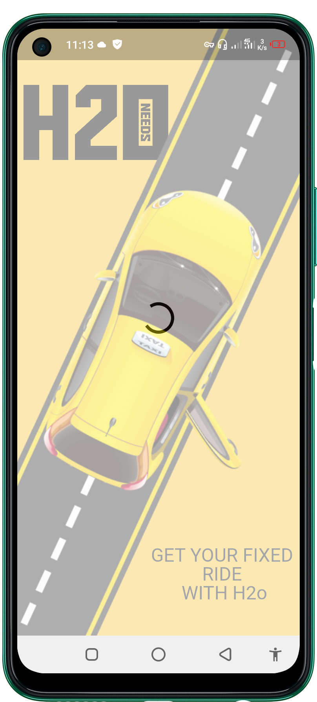
  </td>
  <td style='width:24%;'>
    2. HomePage
  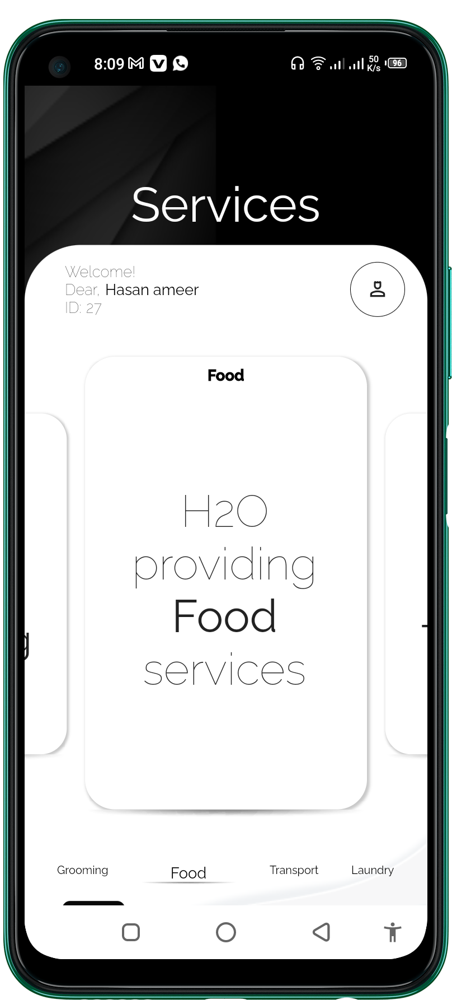
  </td>
   <td style='width:24%;'>
    3. DetailsPage
  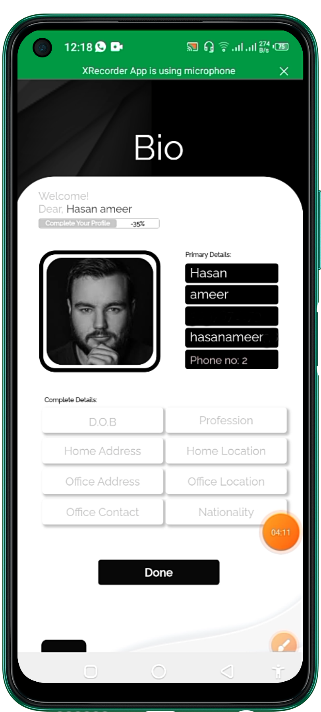
  </td>
   </td>
   <td style='width:24%;'>
    3. Content Upload screen
  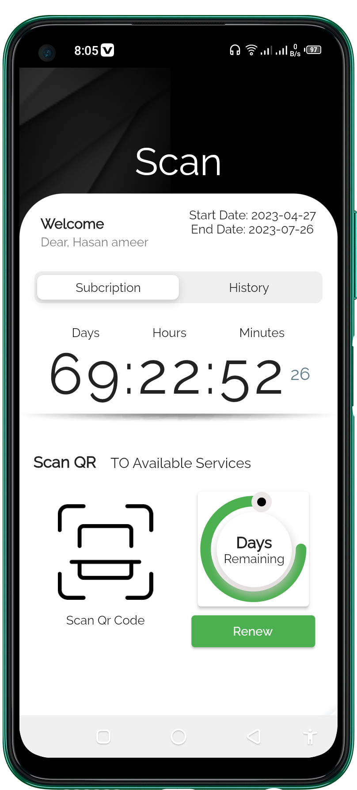
  </td>
</table>

 <table style='border:none;width:100%'>
  <td style='width:24%;'>
    1. Intro
   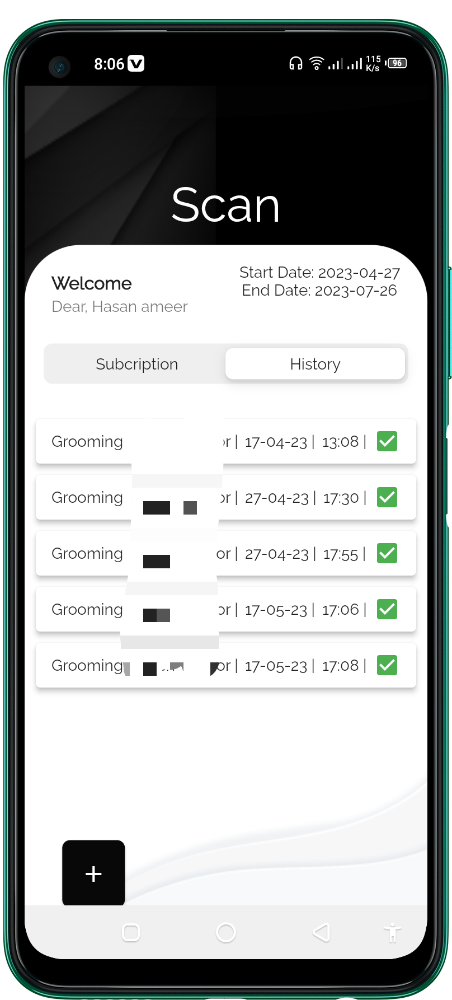
  </td>
  <td style='width:24%;'>
    2. HomePage
  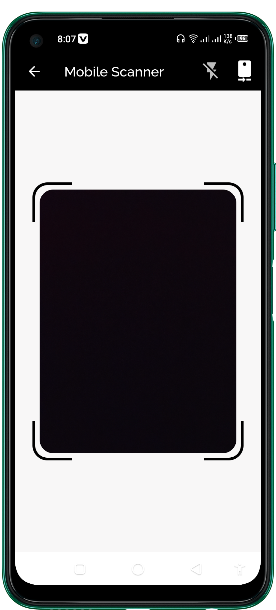
  </td>
   <td style='width:24%;'>
    3. DetailsPage
  
  </td>
   </td>
   <td style='width:24%;'>
    3. Content Upload screen
  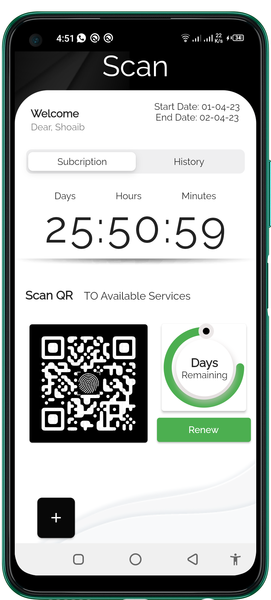
  </td>
</table>

 <table style='border:none;width:100%'>
  <td style='width:24%;'>
    1. Intro
   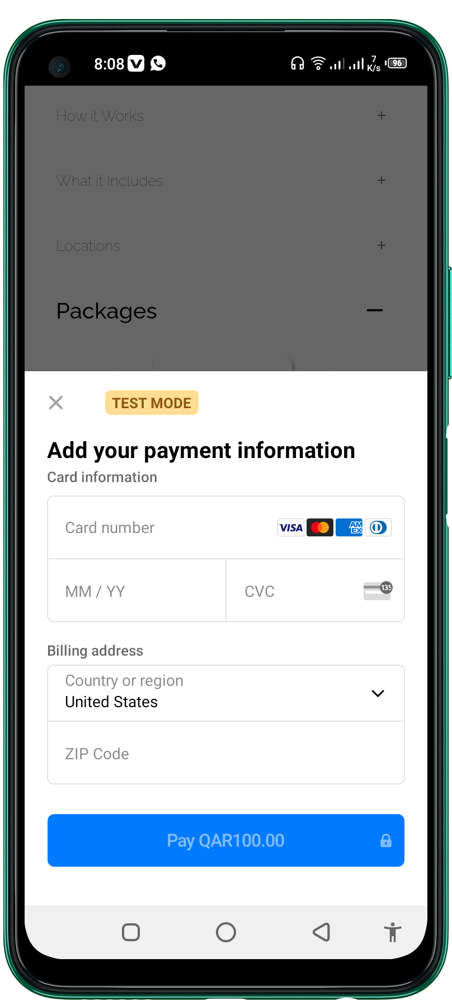
  </td>
  <td style='width:24%;'>
    2. HomePage
  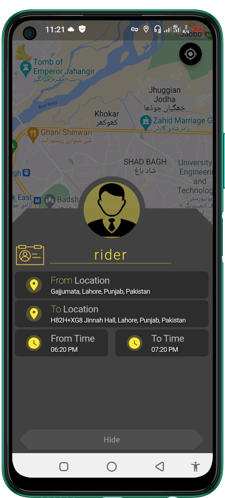
  </td>
   <td style='width:24%;'>
    3. DetailsPage
  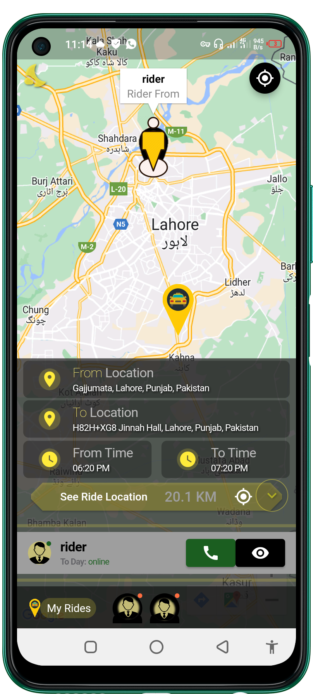
  </td>
   </td>
   <td style='width:24%;'>
    3. Content Upload screen
  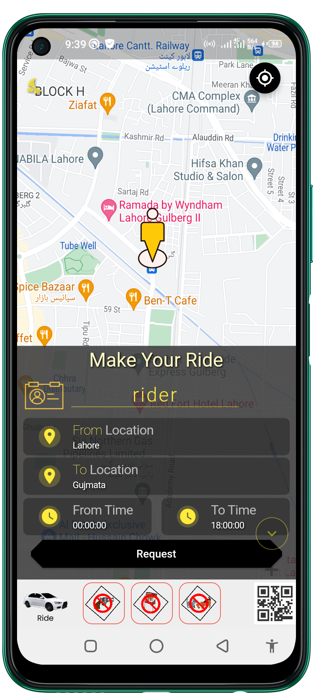
  </td>
</table>

 <table style='border:none;width:100%'>
  <td style='width:24%;'>
    1. Intro
   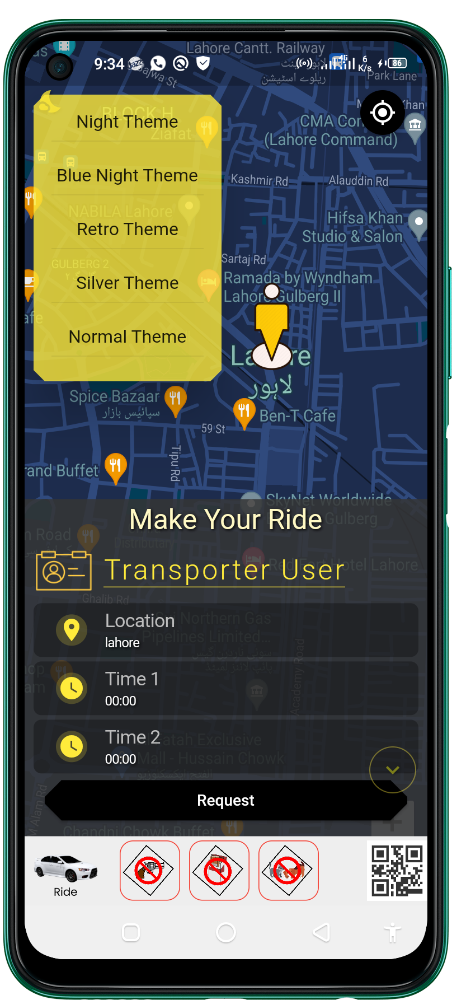
  </td>
  <td style='width:24%;'>
    2. HomePage
  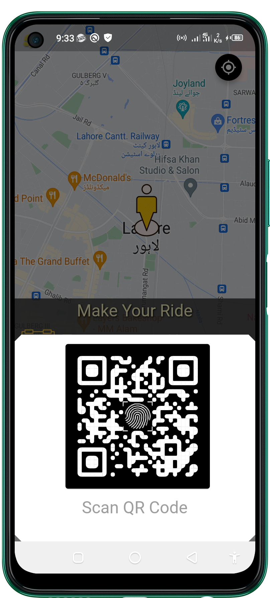
  </td>
   <td style='width:24%;'>
    3. DetailsPage
  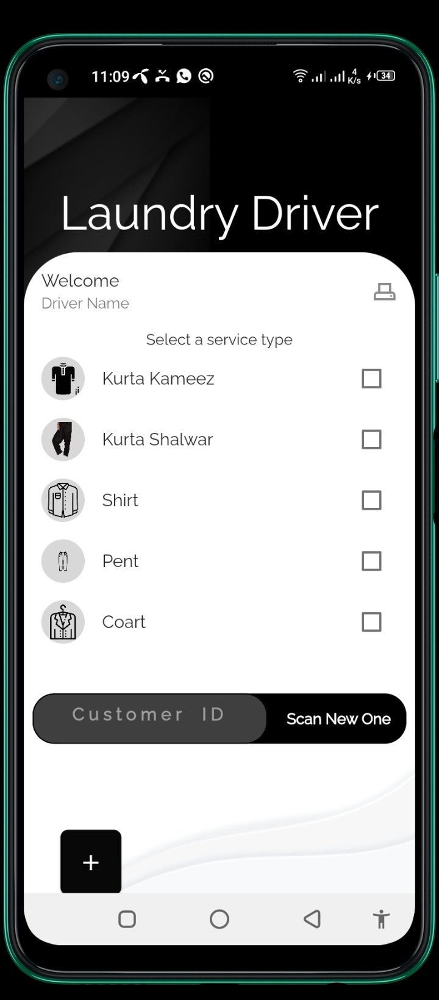
  </td>
   </td>
   <td style='width:24%;'>
    3. Content Upload screen
  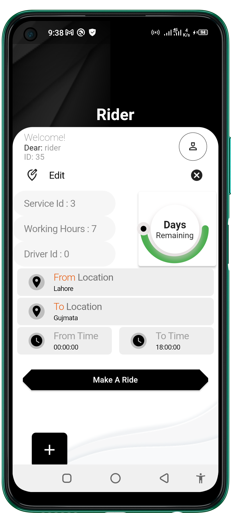
  </td>
</table>

